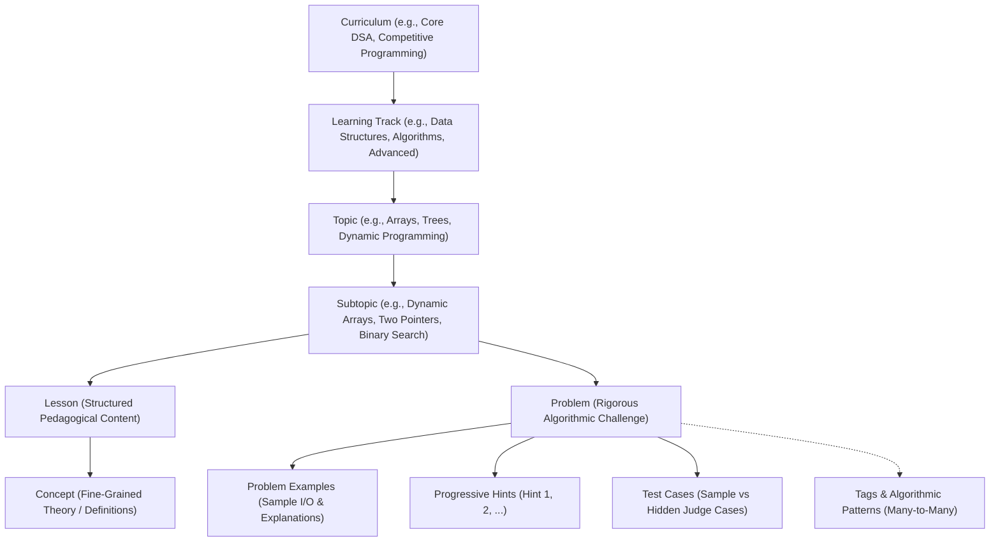
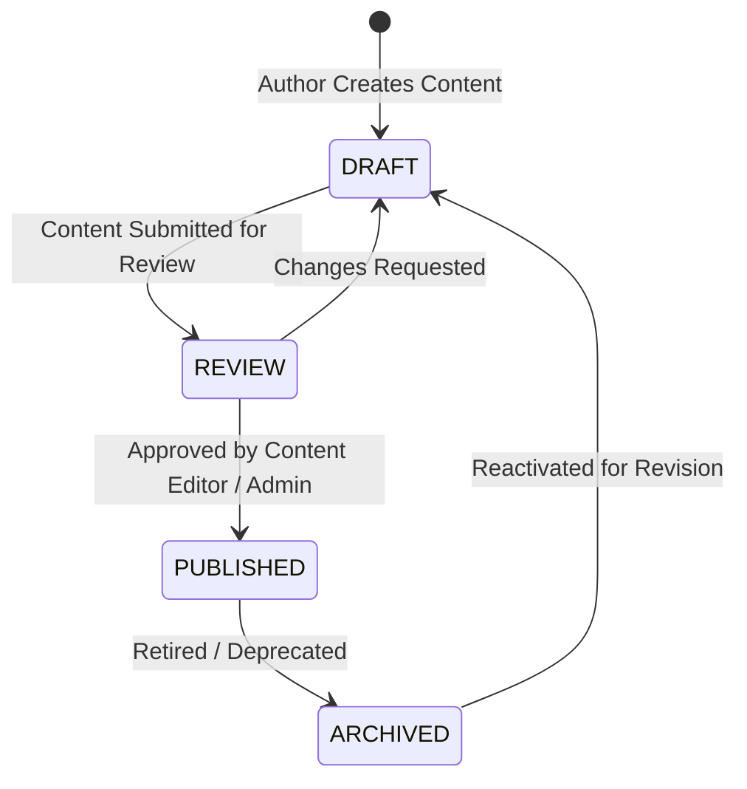

# DSAapp Content & Curriculum Architecture (Phase 3)

## 1. Overview & Pedagogical Hierarchy

DSAapp organizes data structures and algorithms education into a structured, hierarchical content tree designed for arbitrary pedagogical depth, progressive disclosure, and future extensibility (e.g. tracking progress, code execution, and AI tutoring).



---

## 2. Relational Schema & Models

All content entities utilize UUIDv4 identifiers, human-readable unique slugs, audit timestamps (`created_at`, `updated_at`), integer `display_order` sequencing, and integer `version` numbers for revision tracking.

### 2.1 Core Entities

1. **`Curriculum` (`curricula`)**
   - Top-level learning track suite (e.g., `core-dsa-seed`, `system-design`, `interviews`).
   - Fields: `id`, `public_id`, `slug` (unique), `title`, `description`, `short_description`, `level` (`BEGINNER`, `INTERMEDIATE`, `ADVANCED`, `EXPERT`), `status` (`DRAFT`, `REVIEW`, `PUBLISHED`, `ARCHIVED`), `display_order`, `is_free`.

2. **`Track` (`tracks`)**
   - Major pedagogical division within a curriculum (e.g., "Foundations", "Core Data Structures").
   - Belongs to `Curriculum` via foreign key `curriculum_id`.

3. **`Topic` (`topics`)**
   - High-level domain (e.g., "Arrays & Hashing", "Linked Lists", "Trees", "Graphs").
   - Belongs to `Track` via foreign key `track_id`.

4. **`Subtopic` (`subtopics`)**
   - Focused algorithmic techniques (e.g., "Dynamic Arrays", "Two Pointers", "Sliding Window").
   - Belongs to `Topic` via foreign key `topic_id`. Holds zero or more `lessons` and `problems`.

5. **`Lesson` (`lessons`)**
   - Interactive conceptual reading material.
   - Fields: `id`, `public_id`, `subtopic_id`, `slug` (unique), `title`, `summary`, `content_blocks` (structured JSON), `estimated_minutes`, `difficulty`, `display_order`, `access_level` (`FREE` vs `PREMIUM`), `status`, `version`.

6. **`Concept` (`concepts`)**
   - Atomic definitions embedded in lessons (e.g., "Amortized O(1) Resizing").
   - Belongs to `Lesson` via foreign key `lesson_id`.

7. **`Problem` (`problems`)**
   - Algorithmic problem specification.
   - Fields: `id`, `public_id`, `subtopic_id`, `slug` (unique), `title`, `statement`, `difficulty` (`EASY`, `MEDIUM`, `HARD`, `EXPERT`), `access_level` (`FREE`, `PREMIUM`), `status`, `display_order`, `estimated_minutes`, `time_limit_ms`, `memory_limit_mb`, `constraints`, `supported_languages` (JSON list), `editorial`, `version`.
   - Associated with `Tag` and `ProblemPattern` through junction tables `problem_tags` and `problem_patterns`.

8. **`ProblemExample` (`problem_examples`)**
   - Explicit example I/O blocks rendered directly in the problem description.
   - Fields: `problem_id`, `input`, `output`, `explanation`, `display_order`.

9. **`Hint` (`hints`)**
   - Progressive disclosure hints (ordered 1, 2, 3...) to assist learners without spoiling full solutions.
   - Fields: `problem_id`, `hint_number`, `title`, `content`, `is_premium`.

10. **`TestCase` (`test_cases`)**
    - Verification test cases for code execution.
    - Fields: `problem_id`, `input`, `expected_output`, `is_sample` (boolean), `is_hidden` (boolean), `display_order`.
    - **Critical Invariant:** `TestCase` specifies `__test__ = False` to prevent pytest collection confusion.

---

## 3. Content Lifecycle & Publishing Workflow

Content authoring follows a strict state-machine workflow:



### Invariants:
1. **Public Student Isolation:** Public learner endpoints (`GET /api/v1/curricula`, `GET /api/v1/topics`, `GET /api/v1/lessons/{slug}`, `GET /api/v1/problems`, `GET /api/v1/problems/{slug}`) strictly filter query results to `status == ContentStatus.PUBLISHED`.
2. **Draft Content Protection:** Content in `DRAFT`, `REVIEW`, or `ARCHIVED` status returns `404 Not Found` to public users, preventing draft leakage or premature exposure.
3. **Editor Privileges:** Only users with role `admin` or `content_editor` can view drafts or modify content via `/api/v1/admin/content/...`.

---

## 4. Content Access Control & Monetization (Free vs Premium)

The content architecture enforces server-authoritative entitlement checks integrated with Phase 2 subscription services:

- **Free Tier:**
  - Full access to all items where `access_level == ContentAccessLevel.FREE`.
  - Directory metadata (titles, tags, difficulty) is visible for discovery.
- **Premium Tier:**
  - Content marked `access_level == ContentAccessLevel.PREMIUM` requires an active subscription (`has_active_premium(user)`).
  - Unauthenticated requests or free-tier users attempting to access locked content receive an authoritative `HTTP 403 Forbidden` response:
    ```json
    {
      "success": false,
      "error": {
        "code": "HTTP_403",
        "message": "This problem requires an active Premium subscription."
      }
    }
    ```
- **Client-Side Presentation:**
  - Frontend checks the 403 response code and automatically presents the secure `<PremiumGate>` component with an upgrade CTA, preventing broken UI states.

---

## 5. Security Invariants

### 5.1 Hidden Test Case Protection
- **Vulnerability Prevented:** Cheat scripts or scrapers fetching hidden judge cases to bypass online evaluation.
- **Enforcement:** In `content_repo.get_problem_by_slug` and `content_service.get_problem_detail`, queries strictly filter `TestCase.is_hidden == False` and `TestCase.is_sample == True` for all public endpoints.
- **Guaranteed:** Hidden test cases (`is_hidden == True`) are NEVER serialized or returned over student-facing APIs.

### 5.2 XSS-Safe Structured Lesson Blocks
- **Vulnerability Prevented:** Stored Cross-Site Scripting (XSS) via rich text lesson rendering or `dangerouslySetInnerHTML`.
- **Enforcement:** Lesson content is stored as an array of strictly typed JSON blocks:
  - `heading` (`level`: 1 | 2 | 3, `content`: string)
  - `paragraph` (`content`: string)
  - `code` (`language`: string, `content`: string)
  - `note` / `tip` / `warning` (`title`: string, `content`: string)
- **Frontend Rendering:** `LessonPage.tsx` traverses block definitions and renders native React DOM elements (`<h3>`, `<p>`, `<pre><code>`, callout boxes) with strict string text nodes. No arbitrary HTML is interpreted.

### 5.3 Anti-Mass-Assignment & Schema Validation
- Admin write endpoints (`POST /api/v1/admin/content/curricula`, etc.) use Pydantic v2 schemas configured with `extra="forbid"`.
- Prevents malicious injection of unapproved database columns during creation or update.

### 5.4 Safe Parameterized Search & Pagination
- Public problem and topic search endpoints accept bounded query parameters (`page`, `page_size`, `difficulty`, `tag`, `search`).
- Search queries use SQLAlchemy parameterized `ILIKE` clauses with a maximum length cap (100 characters) to prevent database denial-of-service or SQL injection.

---

## 6. Seed Dataset

For local development and automated testing, an idempotent seed routine (`backend/app/db/seed_data.py`) provides verified algorithmic problems:
1. **Two Sum** (`two-sum-seed`) - Easy, Array / Two Pointers, Free.
2. **Best Time to Buy and Sell Stock** (`best-time-to-buy-and-sell-stock-seed`) - Easy, Dynamic Programming / Sliding Window, Free.
3. **Longest Substring Without Repeating Characters** (`longest-substring-without-repeating-characters-seed`) - Medium, Sliding Window / Hash Table, Premium.
4. **Foundational Dynamic Arrays Lesson** (`dynamic-arrays-seed`) - Beginner, Free, structured educational blocks.
