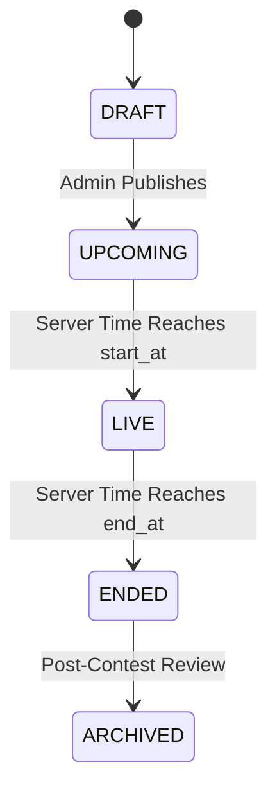

# DSAapp Contest Platform Architecture

## Overview
Phase 8 introduces the production-grade **Arena & Contests Platform** for real-time competitive programming under ICPC rules. The architecture guarantees zero-client authority, strict anti-cheat rate limiting, automated leaderboard scoring, and high-throughput Redis caching.

---

## 1. Lifecycle State Machine
A contest progresses through well-defined lifecycle states:
- `DRAFT`: Administrative editing state, invisible to participants.
- `UPCOMING`: Published and open for user registration. Problems and statements remain strictly shielded.
- `LIVE`: Submissions accepted. Live countdown ticker active. Leaderboard dynamically computes ranks and penalties.
- `ENDED`: No further submissions accepted. Final standings calculated and frozen.
- `ARCHIVED`: Retained for post-contest analysis and upsolving.

### Zero-Client Authority & Server Time Synchronization
- The client NEVER calculates whether a contest is active or remaining time.
- All timestamps (`start_at`, `end_at`, `remaining_seconds`) are computed server-side in UTC.
- When submissions arrive, the server verifies `start_at <= now_utc <= end_at`. Submissions submitted even 1 millisecond outside this window receive `400 Bad Request`.

---

## 2. ICPC Scoring & Leaderboard Rules
Leaderboard ranking is strictly deterministic:
1. **Primary Sort: Solved Count / Total Points** (Descending).
2. **Secondary Sort: Total Penalty Minutes** (Ascending).
3. **Tertiary Tie-Breaker: Timestamp of last accepted submission** (Ascending).

### Penalty Calculation Formula
For each problem:
$$\text{Problem Penalty} = \text{Time in minutes from contest start to Accepted submission} + (20 \times \text{Wrong attempts before Accepted})$$
- Submissions made after an `ACCEPTED` verdict are ignored for score and penalty.
- Unsolved problems do NOT add penalty minutes to the user's score, regardless of attempt count.

---

## 3. High-Performance Redis Standings Caching
To protect the database during live contest traffic spikes:
- Contests maintain standings in Redis with a short TTL (10–30 seconds during `LIVE`, 1 hour during `ENDED`).
- Standings are invalidated upon any `ACCEPTED` verdict or regenerated asynchronously.
- Fallback to database queries is guaranteed if Redis is unavailable.

---

## 4. Anti-Cheat & Fair Play Protections
The platform implements automated heuristic safeguards:
1. **Submission Rate-Limiting / Debounce**:
   - Minimum interval of 5 seconds between consecutive submissions per user per contest.
   - Throttled requests are rejected (`400 Bad Request`) and logged as suspicious bursts.
2. **Code Similarity / Collision Detection**:
   - Exact hash matches of normalized source code between different participants within the same contest generate high-severity `ContestCheatSignal` audit records for admin review.
3. **Registration Boundaries**:
   - Only registered participants can submit solutions or appear in competitive standings.
