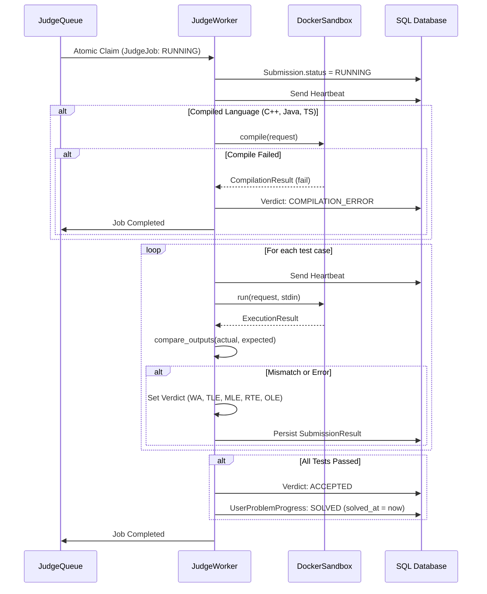

# Judge Worker & Asynchronous Queue Execution (Phase 5)

## 1. Overview

The `JudgeWorker` is an isolated worker process that continuously claims jobs from `JudgeQueue`, executes compilation and test suites within containerized sandboxes, persists results, and synchronizes user problem progress.

---

## 2. Job Execution Lifecycle

---

## 3. Worker Crash Recovery & Dead Job Reclamation

1. **Heartbeat Protocol**: Workers periodically update `heartbeat_at` on their claimed `JudgeJob` (default every 5 seconds).
2. **Reclamation**:
   - `JudgeQueue.reclaim_stale_jobs()` identifies jobs where `status == RUNNING` and `heartbeat_at < now - 30s`.
   - If `attempt_count < max_attempts`, re-queues job (`RETRY_PENDING`).
   - If `attempt_count >= max_attempts`, transitions to `FAILED` and sets submission status to `SYSTEM_ERROR`.
