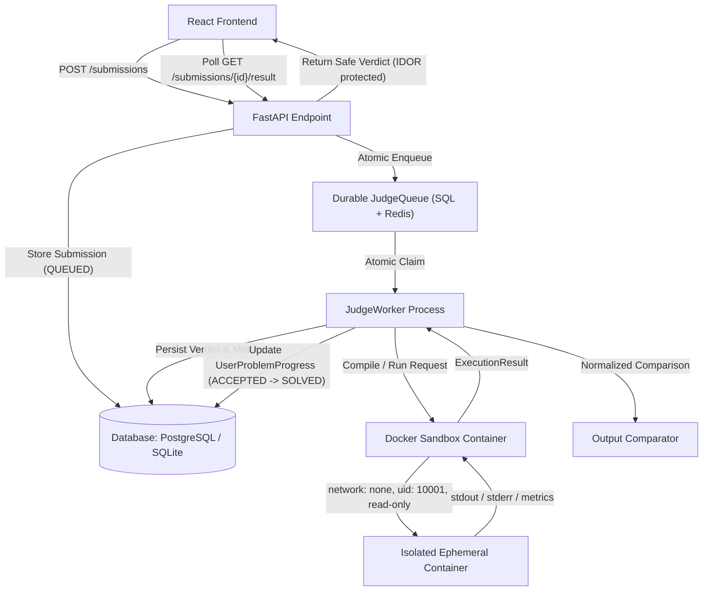

# Online Judge Architecture & Execution Engine (Phase 5)

## 1. Architectural Overview

DSAapp implements an asynchronous, decoupled, zero-trust online judging pipeline designed to securely evaluate arbitrary student code against visible and hidden test cases.

---

## 2. Zero-Trust Security Invariants

Arbitrary student code is treated as strictly hostile input.

1. **Process Isolation**: Untrusted code is NEVER executed inside FastAPI, React, the database, or the host operating system.
2. **Container Sandbox Enclosure**:
   - Zero network access: `--network none`
   - Read-only root filesystem: `--read-only`
   - Dropped capabilities: `cap_drop: ["ALL"]`
   - Non-root user: `uid 10001` (`judge:judge`)
   - Bounded execution time, memory, output, and process limits (`pids_limit: 64`)
3. **Hidden Test Privacy**:
   - Hidden test case inputs and expected outputs are NEVER returned in student API responses.
   - On mismatch, the API returns a generic "Wrong answer on test case" without leaking hidden data.
4. **IDOR & Result Privacy**:
   - `GET /api/v1/submissions/{id}/result` verifies submission ownership or administrative role.
   - Cross-user retrieval returns `404 Not Found`.

---

## 3. Submission Lifecycle & Verdict States

| State / Verdict | Description |
| :--- | :--- |
| `QUEUED` | Job enqueued; awaiting worker pickup. |
| `RUNNING` | Claimed by worker; worker sending heartbeats. |
| `COMPILING` | Executing compiler in sandbox (C++, Java, TypeScript). |
| `JUDGING` | Iterating through test cases with input feeds and output comparison. |
| `ACCEPTED` | All test cases matched expected outputs within limits. Advances problem progress to `SOLVED`. |
| `WRONG_ANSWER` | Output mismatch on one or more test cases. Problem progress remains `ATTEMPTED`. |
| `TIME_LIMIT_EXCEEDED` | Program execution exceeded per-problem `time_limit_ms`. |
| `MEMORY_LIMIT_EXCEEDED` | Program exceeded per-problem `memory_limit_mb`. |
| `RUNTIME_ERROR` | Non-zero exit code or fatal uncaught exception. |
| `COMPILATION_ERROR` | Compiler failed; compiler error log captured safely. |
| `OUTPUT_LIMIT_EXCEEDED` | Program generated output beyond `output_limit_bytes`. |
| `SYSTEM_ERROR` | Runtime or sandbox daemon unavailable. |
| `CANCELLED` | Cancelled by student prior to execution. |

---

## 4. API Endpoints

- `POST /api/v1/submissions`: Submit code (max 64KB UTF-8, language allowlist, idempotency key). Enqueues job.
- `GET /api/v1/submissions/{id}`: Detailed submission metadata and source code (owner-only).
- `GET /api/v1/submissions/{id}/result`: Polling endpoint for execution verdict and metrics (owner-only).
- `POST /api/v1/submissions/{id}/cancel`: Cancels queued submission before worker claim (owner-only).
- `GET /api/v1/admin/judge/health`: Administrator monitoring of queue depth and sandbox engine diagnostics.
- `GET /api/v1/admin/judge/queue`: Queue depth and status breakdown.
- `POST /api/v1/admin/judge/reclaim-stale`: Manual trigger for recovering timed-out or crashed worker jobs.
