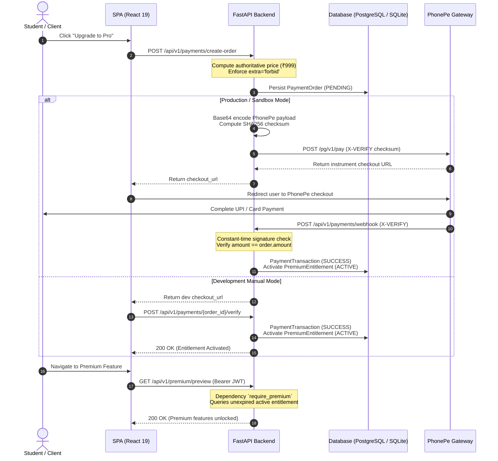

# DSAapp Payment & Premium Entitlements Architecture

This document specifies the payment architecture, PhonePe gateway integration boundary, cryptographic signature verification, idempotency controls, and premium feature entitlement system implemented in **Phase 2**.

---

## 1. Core Architectural Invariants

1. **Zero-Trust Client Pricing (Server-Authoritative)**
   - The frontend never controls, suggests, or passes price amounts to the backend.
   - All order amounts, currencies, and plan durations are computed strictly on the server (`settings.PREMIUM_PRICE = 999`, `settings.PREMIUM_CURRENCY = "INR"`, `settings.PREMIUM_DURATION_DAYS = 365`).
   - Any client payload attempting to inject or modify `amount`, `currency`, or `price` is rejected immediately by schema validation (`extra = "forbid"`).

2. **Non-Custodial Payment Boundary**
   - DSAapp never handles, touches, or stores sensitive credit/debit card numbers, CVVs, expiry dates, netbanking passwords, or UPI PINs.
   - Payment operations are delegated entirely to regulated payment providers (PhonePe PG / UPI Collect / Intent).

3. **Cryptographic Checksum & Signature Verification**
   - Every outbound request and inbound webhook is signed or verified using SHA256 and salt keys.
   - Webhook signatures are verified in constant time (`hmac.compare_digest`) before JSON parsing.

4. **Idempotent Activation & Extension**
   - Duplicate webhook deliveries or duplicate verification requests for the same order cannot create duplicate active subscriptions.
   - If an order has already activated an entitlement, subsequent calls return the existing entitlement.
   - Multiple purchases extend the user's existing active period (`expires_at = existing.expires_at + timedelta(days=duration)`).

5. **IDOR & Privilege Escalation Protection**
   - Users can only query payment orders and transactions that belong to their own authenticated user ID.
   - Admins can query any order for auditing purposes via role enforcement (`require_admin`).

---

## 2. Payment Flow & Sequence



---

## 3. Cryptographic Signature Specifications

### Outbound Pay Request Checksum
PhonePe requires a custom `X-VERIFY` header for outgoing API calls:
```
Checksum = SHA256(payload_base64 + api_endpoint + salt_key) + "###" + salt_index
```
Where:
- `payload_base64`: Base64 encoded JSON string of the payment request.
- `api_endpoint`: e.g., `/pg/v1/pay` or `/pg/v1/status/{merchantId}/{transactionId}`.
- `salt_key`: Secret merchant key provided in server environment variables.
- `salt_index`: Salt index identifier (typically `1`).

### Inbound Webhook Checksum Verification
Inbound callbacks from PhonePe include a base64 encoded response body and `X-VERIFY` header:
```
Expected Checksum = SHA256(response_base64 + salt_key) + "###" + salt_index
```
Verification procedure:
1. Extract `X-VERIFY` header from incoming HTTP request.
2. If `settings.PHONEPE_SALT_KEY` is missing or empty, reject with HTTP 400.
3. Compute expected checksum using the server-side salt key.
4. Execute constant-time equality check:
   ```python
   hmac.compare_digest(expected_checksum, received_checksum)
   ```
5. If check fails, log security alert and return HTTP 400 Bad Request.

---

## 4. Database Schema

### `payment_orders`
| Column | Type | Constraints / Description |
| :--- | :--- | :--- |
| `id` | `VARCHAR(36)` | Primary Key (UUIDv4) |
| `user_id` | `VARCHAR(36)` | Foreign Key -> `users.id` (Indexed) |
| `plan_id` | `VARCHAR(64)` | Default: `plan_premium_annual` |
| `amount` | `INTEGER` | Authoritative amount (₹999) |
| `currency` | `VARCHAR(8)` | Default: `INR` |
| `status` | `VARCHAR(20)` | `PENDING`, `SUCCESS`, `FAILED`, `CANCELLED` |
| `provider` | `VARCHAR(32)` | `phonepe`, `development_manual` |
| `provider_order_id`| `VARCHAR(128)`| External transaction/order ID |
| `checkout_url` | `VARCHAR(1024)`| Payment URL |
| `created_at` | `TIMESTAMP` | UTC creation timestamp |
| `updated_at` | `TIMESTAMP` | UTC update timestamp |

### `payment_transactions`
| Column | Type | Constraints / Description |
| :--- | :--- | :--- |
| `id` | `VARCHAR(36)` | Primary Key (UUIDv4) |
| `order_id` | `VARCHAR(36)` | Foreign Key -> `payment_orders.id` (Indexed) |
| `user_id` | `VARCHAR(36)` | Foreign Key -> `users.id` (Indexed) |
| `amount` | `INTEGER` | Processed transaction amount |
| `currency` | `VARCHAR(8)` | Transaction currency |
| `status` | `VARCHAR(32)` | `SUCCESS`, `FAILED`, etc. |
| `provider_transaction_id` | `VARCHAR(128)` | Unique external transaction ID (Indexed) |
| `raw_response_sanitized` | `TEXT` | Sanitized non-sensitive JSON audit trail |
| `verified_at` | `TIMESTAMP` | UTC verification timestamp |

### `premium_entitlements`
| Column | Type | Constraints / Description |
| :--- | :--- | :--- |
| `id` | `VARCHAR(36)` | Primary Key (UUIDv4) |
| `user_id` | `VARCHAR(36)` | Foreign Key -> `users.id` (Indexed) |
| `plan_id` | `VARCHAR(64)` | Subscription plan ID |
| `status` | `VARCHAR(20)` | `ACTIVE`, `EXPIRED`, `REVOKED` (Indexed) |
| `activated_at` | `TIMESTAMP` | Entitlement start timestamp |
| `expires_at` | `TIMESTAMP` | Entitlement expiration timestamp (Indexed) |
| `source_order_id`| `VARCHAR(36)` | Originating payment order ID |

---

## 5. API Reference

### 1. Create Payment Order
`POST /api/v1/payments/create-order`
- **Auth**: Required (`STUDENT`, `ADMIN`, etc.)
- **Request Body**: `{}` (optional `plan_id`)
- **Response**:
```json
{
  "success": true,
  "data": {
    "order_id": "8c4598d9-2c67-4e6b-a25e-0ce415d4d38c",
    "plan_id": "plan_premium_annual",
    "amount": 999,
    "currency": "INR",
    "status": "PENDING",
    "checkout_url": "/status?dev_order_id=...",
    "created_at": "2026-09-29T14:40:00Z"
  }
}
```

### 2. Get Order Status
`GET /api/v1/payments/{order_id}/status`
- **Auth**: Required
- **IDOR Check**: User must own `order_id` unless role is `ADMIN`.

### 3. Verify Order (Dev Simulator)
`POST /api/v1/payments/{order_id}/verify`
- **Auth**: Required (Owner)
- **Request Body**: `{"transaction_id": "tx_mock_123"}`
- **Response**: Activates entitlement and returns active status.

### 4. PhonePe Webhook Callback
`POST /api/v1/payments/webhook`
- **Auth**: Open endpoint, cryptographically secured via `X-VERIFY` header.
- **Request Body**: `{"response": "<base64_json>"}`

### 5. Payment History
`GET /api/v1/payments/history`
- **Auth**: Required
- **Response**: Array of sanitized user payment transactions.

### 6. Premium Gate Preview
`GET /api/v1/premium/preview`
- **Auth**: Required + `require_premium` gate.
- **Response (403)**:
```json
{
  "success": false,
  "error": {
    "code": "HTTP_403",
    "message": "This feature requires an active Premium subscription."
  }
}
```
- **Response (200)**: Unlocks feature array once active entitlement is confirmed.
